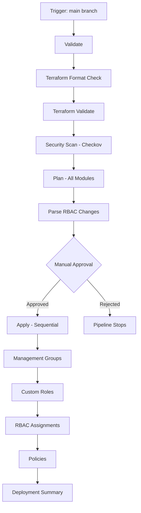

# Azure RBAC & Governance Pipeline

This directory contains the Azure DevOps CI/CD pipeline for deploying and managing Azure RBAC, PIM, and governance policies through infrastructure as code.

## 📋 Table of Contents

- [Overview](#overview)
- [Pipeline Architecture](#pipeline-architecture)
- [Prerequisites](#prerequisites)
- [Setup Instructions](#setup-instructions)
- [Pipeline Stages](#pipeline-stages)
- [RBAC Change Detection](#rbac-change-detection)
- [Approval Process](#approval-process)
- [Variable Groups](#variable-groups)
- [Security Features](#security-features)
- [Troubleshooting](#troubleshooting)

---

## Overview

The pipeline provides automated deployment of Azure governance components with built-in security controls:

- **Multi-stage validation** - Format, validate, and security scan
- **RBAC change detection** - Highlights role assignment modifications
- **Approval gates** - Manual approval required before production deployment
- **Sequential deployment** - Ordered application of infrastructure changes
- **State management** - Remote state with locking and versioning

---

## Pipeline Architecture

### Stage Flow



### Module Deployment Order

1. **Management Groups** - Foundation hierarchy
2. **Custom Roles** - Required before assignments
3. **RBAC Assignments** - Role bindings to groups
4. **Policies** - Governance guardrails

---

## Prerequisites

### Azure Resources

- [ ] Azure subscription with appropriate permissions
- [ ] Azure AD Premium P2 license (for PIM)
- [ ] Terraform state storage account (see setup script)

### Azure DevOps

- [ ] Azure DevOps organization
- [ ] Project with repository access
- [ ] Service connection to Azure subscription
- [ ] Variable group configured

### Local Development

- [ ] Terraform >= 1.5.7
- [ ] Azure CLI >= 2.50.x
- [ ] Python 3.x (for RBAC parser script)
- [ ] Git

---

## Setup Instructions

### Step 1: Create Terraform Backend

Run the backend setup script to create required Azure resources:

```bash
cd pipeline/scripts
./setup-terraform-backend.sh
```

This creates:
- Resource Group: `rg-terraform`
- Storage Account: `sttfstateta` (with versioning and soft delete)
- Container: `rbac-governance`

**Note:** You can customize these values via environment variables:
```bash
export TF_STATE_RG="my-rg-name"
export TF_STATE_SA="mystorageaccount"
export TF_STATE_CONTAINER="my-container"
export AZURE_LOCATION="westeurope"
./setup-terraform-backend.sh
```

### Step 2: Create Azure DevOps Service Connection

1. Navigate to **Project Settings** → **Service connections**
2. Create new **Azure Resource Manager** connection
3. Select **Service Principal (automatic)**
4. Choose appropriate subscription
5. Name it (e.g., `AzureRBACServiceConnection`)
6. Save the connection name for variable group

### Step 3: Create Variable Group

1. Navigate to **Pipelines** → **Library**
2. Create variable group named `terraform-variables`
3. Add the following variables:

| Variable Name | Value | Secret? | Description |
|--------------|-------|---------|-------------|
| `AZURE_SERVICE_CONNECTION` | `AzureRBACServiceConnection` | No | Name of Azure service connection |
| `TF_STATE_RG` | `rg-terraform` | No | Terraform state resource group |
| `TF_STATE_SA` | `sttfstateta` | No | Terraform state storage account |
| `TF_STATE_CONTAINER` | `rbac-governance` | No | Terraform state container name |
| `SECURITY_TEAM_EMAIL` | `security-team@company.com` | No | Email for approval notifications |
| `PLATFORM_TEAM_EMAIL` | `platform-team@company.com` | No | Email for approval notifications |

### Step 4: Grant Service Principal Permissions

The pipeline service principal needs:

#### Terraform State Access
```bash
# Storage Blob Data Contributor on state storage
az role assignment create \
  --assignee <SERVICE_PRINCIPAL_ID> \
  --role "Storage Blob Data Contributor" \
  --scope "/subscriptions/<SUB_ID>/resourceGroups/rg-terraform/providers/Microsoft.Storage/storageAccounts/sttfstateta"
```

#### Azure RBAC Management
```bash
# Owner at Management Group level (or appropriate scope)
az role assignment create \
  --assignee <SERVICE_PRINCIPAL_ID> \
  --role "Owner" \
  --scope "/providers/Microsoft.Management/managementGroups/<MG_ID>"
```

#### Azure AD Permissions

Grant the service principal these Microsoft Graph API permissions:
- `Group.ReadWrite.All` - Create and manage Entra ID groups
- `RoleManagement.ReadWrite.Directory` - Manage directory role assignments

```bash
# Step 1: Get the App ID from your service principal
SP_ID="<SERVICE_PRINCIPAL_ID>"
APP_ID=$(az ad sp show --id $SP_ID --query appId -o tsv)
echo "App ID: $APP_ID"

# Step 2: Add the required permissions
az ad app permission add \
  --id $APP_ID \
  --api 00000003-0000-0000-c000-000000000000 \
  --api-permissions \
    62a82d76-70ea-41e2-9197-370581804d09=Role \
    9e3f62cf-ca93-4989-b6ce-bf83c28f9fe8=Role

# Step 3: Grant admin consent (REQUIRED for Application permissions)
# This is the critical step - Application (Role) permissions require admin consent
az ad app permission admin-consent --id $APP_ID

# Step 4: Verify permissions were granted (wait 1-2 minutes for propagation)
az ad app permission list --id $APP_ID --query "[].{API:resourceAppId, Permissions:resourceAccess[].id}" -o table
```

**Important Notes:**
- You must be a **Global Administrator** or **Privileged Role Administrator** to grant admin consent
- The `az ad app permission grant` command (suggested by CLI output) only works for delegated permissions, not Application permissions
- Wait 5-10 minutes after granting for permissions to fully propagate
- Verify in Azure Portal: **Entra ID** → **App registrations** → **API permissions** → should show green checkmarks

### Step 5: Create Pipeline

1. Navigate to **Pipelines** → **Create Pipeline**
2. Select **Azure Repos Git**
3. Select your repository
4. Choose **Existing Azure Pipelines YAML file**
5. Select `/pipeline/azure-pipelines.yml`
6. Save (don't run yet)

### Step 6: Create Production Environment

1. Navigate to **Pipelines** → **Environments**
2. Create environment named `production`
3. Add approvers (optional additional approval layer)

### Step 7: Initialize Terraform Locally

Before first pipeline run, initialize each module:

```bash
# Management Groups
cd management-groups
terraform init

# RBAC
cd ../rbac
terraform init

# Custom Roles
cd ../custom-roles
terraform init

# Policies
cd ../policies
terraform init
```

---

## Pipeline Stages

### Stage 1: Validate

**Purpose:** Ensure code quality and security compliance

**Jobs:**
1. **Terraform Validation**
   - Format check (`terraform fmt -check`)
   - Syntax validation (`terraform validate`)

2. **Security Scanning**
   - Checkov scan for IaC security issues
   - Soft-fail mode (warnings don't block)

**Triggers:** All commits to `main` branch, all PRs

### Stage 2: Plan

**Purpose:** Generate Terraform execution plans for all modules

**Jobs:**
1. `PlanManagementGroups` - Plan management group changes
2. `PlanRBAC` - Plan role assignment changes
3. `PlanCustomRoles` - Plan custom role changes
4. `PlanPolicies` - Plan policy changes
5. `AnalyzeRBACChanges` - Parse and highlight RBAC modifications

**Outputs:**
- Terraform plan files (artifacts)
- Plan JSON files (for analysis)
- RBAC change summary (markdown report)

**Triggers:** After successful validation

### Stage 3: Approve

**Purpose:** Manual approval gate for production changes

**Jobs:**
1. `ApprovalGate` - Manual validation task

**Features:**
- Notifies security and platform teams via email
- Provides detailed review checklist
- 7-day timeout (auto-reject)
- Requires explicit approval

**Triggers:** Only for `main` branch (not PRs)

### Stage 4: Apply

**Purpose:** Deploy changes to Azure

**Deployment Order:**
1. **Management Groups** - Foundation structure
2. **Custom Roles** - Role definitions
3. **RBAC Assignments** - Role bindings
4. **Policies** - Governance policies

**Features:**
- Uses approved plan artifacts
- Sequential execution (dependencies)
- Deployment summary generation
- Uses Azure DevOps environments

**Triggers:** After manual approval

---

## RBAC Change Detection

### Purpose

The RBAC change parser (`parse-rbac-changes.py`) analyzes Terraform plans and highlights:
- Role assignment additions/modifications/deletions
- Entra ID group changes
- Custom role permission changes
- **High-risk changes** (Owner, User Access Administrator)

### Output Format

**Console Output:**
```
================================================================================
RBAC CHANGES DETECTED
================================================================================

Total Changes: 5
High-Risk Changes: 1
Role Assignments: 3
Custom Roles: 1
Entra ID Groups: 1

--------------------------------------------------------------------------------
➕ ADDITIONS (3)
--------------------------------------------------------------------------------

ADD: azurerm_role_assignment.platform_owner
Type: azurerm_role_assignment
  Role: Owner
  Scope: Management Group: Platform
  Principal: a1b2c3d4...
  ⚠️  HIGH RISK: Privileged role assignment
```

**Markdown Report:**
Generated as pipeline artifact (`rbac-changes.md`) with:
- Executive summary
- Categorized changes (add/modify/remove)
- High-risk warnings
- Review checklist

### Usage

The script is automatically run during the **Plan** stage. Manual usage:

```bash
python3 pipeline/scripts/parse-rbac-changes.py <plan.json>
```

---

## Approval Process

### Approval Workflow

1. **Plan Stage Completes**
   - Terraform plans generated
   - RBAC changes analyzed
   - Artifacts published

2. **Approval Stage Triggers**
   - Email sent to security and platform teams
   - Pipeline pauses (up to 7 days)

3. **Reviewers Actions**
   - Download plan artifacts
   - Review RBAC change summary
   - Verify against change ticket
   - Check for unauthorized changes

4. **Approval Decision**
   - **Approve** → Pipeline continues to Apply stage
   - **Reject** → Pipeline stops, no changes deployed
   - **Timeout** → Pipeline auto-rejects after 7 days

### Review Checklist

Before approving, verify:

- [ ] All changes documented in approved change ticket
- [ ] No unauthorized privilege escalations
- [ ] High-risk changes reviewed by security team
- [ ] Custom role permissions follow least-privilege
- [ ] Policy assignments have proper scope
- [ ] No policy exemptions without justification
- [ ] Terraform plan matches expected changes

---

## Variable Groups

### Required Variables

All variables stored in Azure DevOps Library variable group: `terraform-variables`

#### Service Connection
- `AZURE_SERVICE_CONNECTION` - Azure Resource Manager service connection name

#### Terraform State Backend
- `TF_STATE_RG` - Resource group for Terraform state
- `TF_STATE_SA` - Storage account for Terraform state
- `TF_STATE_CONTAINER` - Container name for state files

#### Notifications
- `SECURITY_TEAM_EMAIL` - Email for security team approvers
- `PLATFORM_TEAM_EMAIL` - Email for platform team approvers

### Optional Variables

You can add these to variable group for customization:

- `TF_VERSION` - Override Terraform version (default: 1.5.7)
- `CHECKOV_SKIP_CHECK` - Skip specific Checkov checks

---

## Security Features

### 1. State Management Security

- **Encryption at rest** - Storage account encryption enabled
- **Versioning** - Blob versioning protects against overwrites
- **Soft delete** - 7-day recovery window
- **TLS 1.2+** - Enforced minimum TLS version
- **HTTPS only** - No HTTP access allowed
- **State locking** - Azure Storage blob lease prevents concurrent modifications
- **No public access** - Private containers only

### 2. Pipeline Security

- **Service principal least-privilege** - Scoped permissions
- **Manual approval gates** - Human review required
- **RBAC change visibility** - Automated detection and highlighting
- **Security scanning** - Checkov IaC analysis
- **Artifact isolation** - Plans generated in separate stage
- **Audit trail** - All approvals logged in Azure DevOps

### 3. Code Security

- **Format validation** - Consistent code style
- **Syntax validation** - Terraform validate checks
- **Version pinning** - Provider versions locked
- **No secrets in code** - Service principal auth only

### 4. Deployment Security

- **Sequential stages** - Controlled deployment order
- **Plan artifact reuse** - Apply uses approved plan (no drift)
- **Environment gates** - Production environment protection
- **Notification system** - Alert on deployments

---

## Troubleshooting

### Common Issues

#### 1. Pipeline Fails at Terraform Init

**Error:** "Backend configuration changed"

**Solution:**
```bash
# Re-run backend setup script
cd pipeline/scripts
./setup-terraform-backend.sh

# Or manually re-initialize
cd <module>
terraform init -reconfigure
```

#### 2. Service Principal Permission Denied

**Error:** "Authorization failed" or "Forbidden"

**Solution:**
- Verify service principal has Owner role at appropriate scope
- Check Microsoft Graph API permissions granted
- Ensure admin consent provided for Graph permissions

```bash
# Check current role assignments
az role assignment list --assignee <SP_ID> --all
```

#### 3. State Lock Error

**Error:** "Error acquiring state lock"

**Solution:**
```bash
# Force unlock (use carefully!)
cd <module>
terraform force-unlock <LOCK_ID>
```

Or check/remove lease in Azure Portal:
1. Navigate to storage account
2. Find blob: `<module>.tfstate`
3. Check for active lease
4. Break lease if stuck

#### 4. RBAC Parser Script Fails

**Error:** "No module named 'json'"

**Solution:**
```bash
# Ensure Python 3 is being used
python3 --version

# Manually test script
cd pipeline/scripts
python3 parse-rbac-changes.py <path-to-plan.json>
```

#### 5. Approval Email Not Received

**Solution:**
- Verify email addresses in variable group
- Check Azure DevOps notification settings
- Review spam/junk folders
- Manually check pipeline for approval task

#### 6. Plan/Apply Mismatch

**Error:** "Plan has changed since approval"

**Cause:** Someone made manual changes in Azure Portal

**Solution:**
1. Review what changed
2. Update Terraform to match (import resources)
3. Re-run pipeline

#### 7. Checkov Blocks Pipeline

**Error:** Checkov security check failures

**Solution:**
Option 1: Fix the security issue
Option 2: Add exception with justification:
```hcl
# In your .tf file
#checkov:skip=CKV_AZURE_XX:Justification here
```

### Debug Mode

Enable detailed Terraform output:

```yaml
# In azure-pipelines.yml, add to terraform commands:
TF_LOG=DEBUG terraform plan
```

### Pipeline Variables for Debugging

Add to variable group temporarily:

- `system.debug` = `true` - Verbose pipeline logs

---

## Best Practices

### 1. Always Review Plans

Never approve without reviewing:
- Terraform plan output
- RBAC change summary
- Artifacts from Plan stage

### 2. Document Changes

- Link change tickets in approval comments
- Update documentation if architecture changes
- Document any exemptions or exceptions

### 3. Test in Non-Prod First

- Create separate variable group for non-prod
- Test pipeline changes in dev environment
- Validate RBAC changes don't break access

### 4. Regular State Backups

```bash
# Backup state files periodically
az storage blob download \
  --account-name sttfstateta \
  --container-name rbac-governance \
  --name rbac.tfstate \
  --file backups/rbac-$(date +%Y%m%d).tfstate
```

### 5. Monitor Post-Deployment

After approval and deployment:
- Check Azure Activity Log
- Verify role assignments in Portal
- Test PIM activation workflows
- Review Azure Policy compliance

### 6. Rotate Service Principal Credentials

```bash
# Rotate every 90 days
az ad sp credential reset --id <SP_ID>
# Update service connection in Azure DevOps
```

---

## Additional Resources

### Scripts

- [`setup-terraform-backend.sh`](scripts/setup-terraform-backend.sh) - Backend infrastructure setup
- [`parse-rbac-changes.py`](scripts/parse-rbac-changes.py) - RBAC change detection

### Documentation

- [Main Project README](../README.md)
- [Implementation Plan](../plan.md)
- [Azure DevOps Pipelines Docs](https://docs.microsoft.com/en-us/azure/devops/pipelines/)
- [Terraform AzureRM Provider](https://registry.terraform.io/providers/hashicorp/azurerm/latest/docs)

### Support

- **Issues:** Report in project repository
- **Questions:** Contact platform team
- **Security Concerns:** Contact security team immediately

---

## Maintenance

### Regular Tasks

| Task | Frequency | Owner |
|------|-----------|-------|
| Review service principal permissions | Monthly | Platform Team |
| Rotate service principal credentials | 90 days | Security Team |
| Review approval logs | Monthly | Security Team |
| Validate state backups | Weekly | Platform Team |
| Update Terraform version | Quarterly | Platform Team |
| Review and update pipeline | Quarterly | Platform Team |

---

## Version History

| Version | Date | Changes |
|---------|------|---------|
| 1.0 | 2026-02-27 | Initial pipeline implementation |

---

**Pipeline Status:** ✅ Production Ready

**Last Updated:** 2026-02-27
**Maintained By:** Platform Engineering Team
